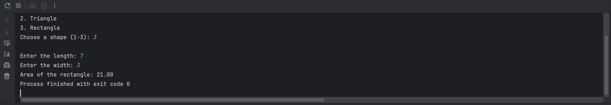

# General Malit
### Area Calculator

the code seems to be functionally correct and all test cases run and pass except for test case 2 and 6, which by manual checking, is supposed to run without any mistakes.